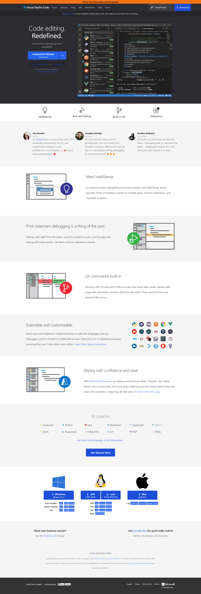

# Project - 07 HTML & CSS

# VS Code Clone Project

- ## In this Project I have build clone of [VS Code](https://ineuron-rode-clone-project-18.netlify.app/) website.

- ## I have build this entire UI of VS Code website with CSS.

---

- [VS Code Project Live Link](https://ineuron-rode-clone-project-18.netlify.app/)

## Time-taken: 10hrs

- ### _From Scratch to make VS Code clone time taken_ - 

- ### _Time taken to use CSS_ - 

## Name : Atul Singh

---

## What I have learned during this Project?

- ### _Core CSS_

- ### _How to use CSS_

- ### _I learned to make a responsive website using CSS_

---

 

